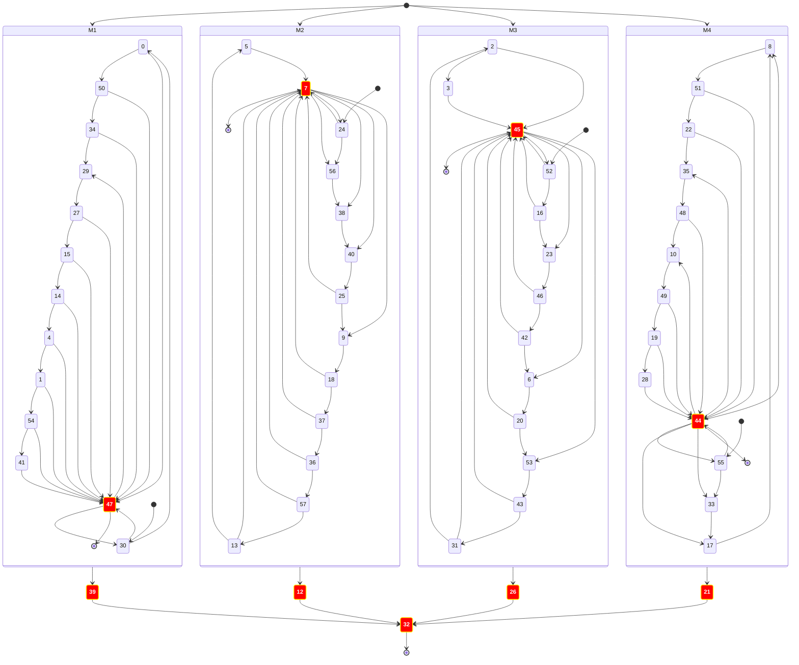

```mermaid
stateDiagram-v2
    classDef conjunction fill:#f00,color:white,font-weight:bold,stroke-width:2px,stroke:yellow

    [*] --> M1
    [*] --> M2
    [*] --> M3
    [*] --> M4

    state M1 {
        [*] --> 30
        30 --> 47
        47 --> 30
        30 --> 0
        1 --> 54
        4 --> 1
        54 --> 41
        14 --> 4
        15 --> 14
        27 --> 15
        0 --> 50
        29 --> 27
        34 --> 29
        50 --> 34
        0 --> 47
        1 --> 47
        14 --> 47
        15 --> 47
        27 --> 47
        34 --> 47
        4 --> 47
        41 --> 47
        50 --> 47
        54 --> 47
        47 --> 29
        47 --> [*]
    }
    class 47 conjunction
    M1 --> 39
    39 --> 32
    class 39 conjunction

    state M2 {
        [*] --> 24
        24 --> 7
        7 --> 24
        24 --> 56
        5 --> 7
        13 --> 7
        18 --> 7
        25 --> 7
        36 --> 7
        37 --> 7
        57 --> 7
        7 --> 9
        7 --> 38
        7 --> 40
        7 --> 56
        9 --> 18
        13 --> 5
        18 --> 37
        25 --> 9
        36 --> 57
        37 --> 36
        38 --> 40
        40 --> 25
        56 --> 38
        57 --> 13
        7 --> [*]
    }
    class 7 conjunction
    M2 --> 12
    12 --> 32
    class 12 conjunction

    state M3 {
        [*] --> 52
        45 --> 52
        52 --> 45
        52 --> 16
        2 --> 45
        3 --> 45
        16 --> 45
        20 --> 45
        31 --> 45
        42 --> 45
        43 --> 45
        45 --> 53
        45 --> 23
        45 --> 6
        46 --> 45
        2 --> 3
        16 --> 23
        23 --> 46
        46 --> 42
        42 --> 6
        6 --> 20
        20 --> 53
        53 --> 43
        43 --> 31
        31 --> 2
        45 --> [*]
    }
    class 45 conjunction
    M3 --> 26
    26 --> 32
    class 26 conjunction

    state M4 {
        [*] --> 55
        55 --> 44
        55 --> 33
        44 --> 55
        44 --> 17
        44 --> 10
        44 --> 8
        44 --> 33
        44 --> 35
        44 --> [*]
        33 --> 17
        17 --> 8
        8 --> 51
        51 --> 22
        22 --> 35
        35 --> 48
        48 --> 10
        10 --> 49
        19 --> 28
        49 --> 19
        19 --> 44
        22 --> 44
        28 --> 44
        48 --> 44
        49 --> 44
        51 --> 44
    }
    class 44 conjunction
    M4 --> 21
    21 --> 32
    class 21 conjunction

    32 --> [*]
    class 32 conjunction

```
